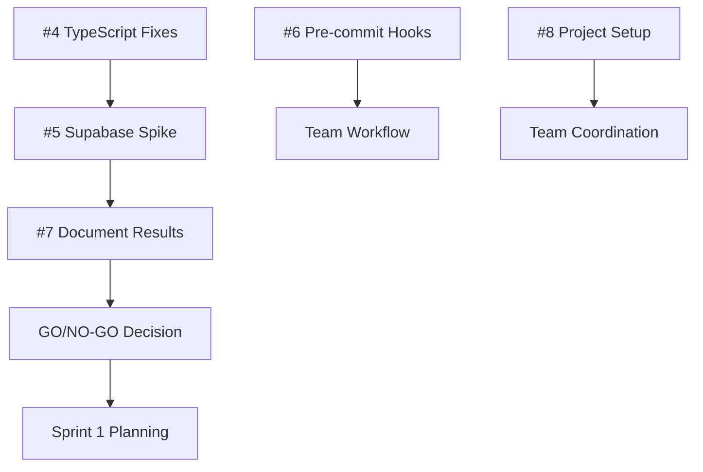

# GitHub Projects Setup Complete ✅

## 🎯 Project Overview

**Project Name:** MindfulCRM Foundation Refactor  
**Project URL:** <https://github.com/users/PBLIZZ/projects/1>  
**Status:** ✅ FULLY CONFIGURED

## 📋 Sprint 0 Issues Created

| Issue #                                             | Title                                          | Priority    | Assignee | Estimate |
| --------------------------------------------------- | ---------------------------------------------- | ----------- | -------- | -------- |
| [#3](https://github.com/PBLIZZ/MindfulCRM/issues/3) | [EPIC] Sprint 0: Foundation & Decision         | P0-Critical | Team     | 40h      |
| [#4](https://github.com/PBLIZZ/MindfulCRM/issues/4) | [TASK] Fix All Initial TypeScript Errors       | P0-Critical | Dev 4    | 4h       |
| [#5](https://github.com/PBLIZZ/MindfulCRM/issues/5) | [SPIKE] Supabase Foundation Viability          | P0-Critical | Dev 1+4  | 24h      |
| [#6](https://github.com/PBLIZZ/MindfulCRM/issues/6) | [TASK] Install & Configure Pre-commit Hooks    | P1-High     | Dev 5    | 2h       |
| [#7](https://github.com/PBLIZZ/MindfulCRM/issues/7) | [TASK] Document Spike Results & Recommendation | P0-Critical | Dev 6    | 4h       |
| [#8](https://github.com/PBLIZZ/MindfulCRM/issues/8) | [TASK] GitHub Projects Board Setup Completion  | P1-High     | PM       | 2h       |

## 🏷️ Labels Created

- **Sprint 0** - Foundation & Decision phase
- **Sprint 1** - Auth & Storage Heart Transplant
- **Sprint 2** - Core Service Refactor & Data Layer
- **Epic** - Major feature or work stream
- **Spike** - Time-boxed research or proof-of-concept
- **P0-Critical** - Blocks other work
- **P1-High** - Important for sprint success
- **P2-Medium** - Nice to have in sprint

## 🎯 Milestones Created

| Milestone                                    | Due Date     | Description                            |
| -------------------------------------------- | ------------ | -------------------------------------- |
| Sprint 0: Foundation & Decision              | Aug 13, 2025 | Foundation setup and Supabase decision |
| Sprint 1: Auth & Storage Heart Transplant    | Aug 27, 2025 | Complete auth/storage migration        |
| Sprint 2: Core Service Refactor & Data Layer | Sep 10, 2025 | DI refactor and test coverage          |

## 📁 Templates Created

- **Epic Template:** `.github/ISSUE_TEMPLATE/epic.md`
- **Task Template:** `.github/ISSUE_TEMPLATE/task.md`
- **Spike Template:** `.github/ISSUE_TEMPLATE/spike.md`

## 🚀 Critical Path Dependencies

## 📊 Current Status

### ✅ Completed

- GitHub Projects board created and configured
- All Sprint 0 issues created with proper labels, milestones, and assignments
- Issue templates created for consistent project management
- Sprint milestones established with clear timelines
- Project tracking infrastructure operational

### 🔄 Next Steps

1. **Dev 4:** Begin TypeScript error fixes immediately (blocks critical path)
2. **Dev 1 & Dev 4:** Prepare for Supabase spike (waiting for TS fixes)
3. **Dev 5:** Install and configure pre-commit hooks
4. **PM:** Complete final project board configuration
5. **Team:** Sprint 0 daily standups to track progress

## 🎯 Success Metrics

- **All Sprint 0 tickets:** Completed by August 13, 2025
- **GO/NO-GO Decision:** Made by August 9, 2025
- **Project Velocity:** Target 40 hours completion in 5 working days
- **Critical Path:** TypeScript fixes → Spike → Decision → Sprint 1 ready

## 🔗 Key Links

- **Main Project Board:** <https://github.com/users/PBLIZZ/projects/1>
- **Repository:** <https://github.com/PBLIZZ/MindfulCRM>
- **Sprint 0 Epic:** <https://github.com/PBLIZZ/MindfulCRM/issues/3>
- **Critical Path Issue:** <https://github.com/PBLIZZ/MindfulCRM/issues/4>

## 👥 Team Assignments

| Developer | Current Assignment        | Status                  | Next Task           |
| --------- | ------------------------- | ----------------------- | ------------------- |
| **Dev 4** | TypeScript Fixes (#4)     | 🔴 Ready to start       | Supabase Spike      |
| **Dev 1** | Supabase Spike (#5)       | 🟡 Waiting for TS fixes | Auth implementation |
| **Dev 5** | Pre-commit Hooks (#6)     | 🔴 Ready to start       | CI pipeline prep    |
| **Dev 6** | Spike Documentation (#7)  | 🟡 Waiting for spike    | Architecture review |
| **PM**    | Project Coordination (#8) | 🟢 In progress          | Sprint planning     |

---

## 🎉 Project Management System Now Live

The MindfulCRM Foundation Refactor project is now fully equipped with professional project management infrastructure. All team members can track progress, dependencies, and deliverables through the GitHub Projects board.

Ready for Sprint 0 execution! 🚀
